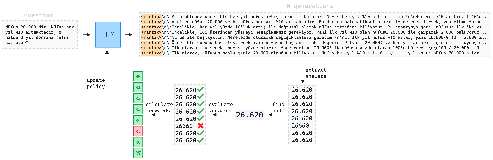
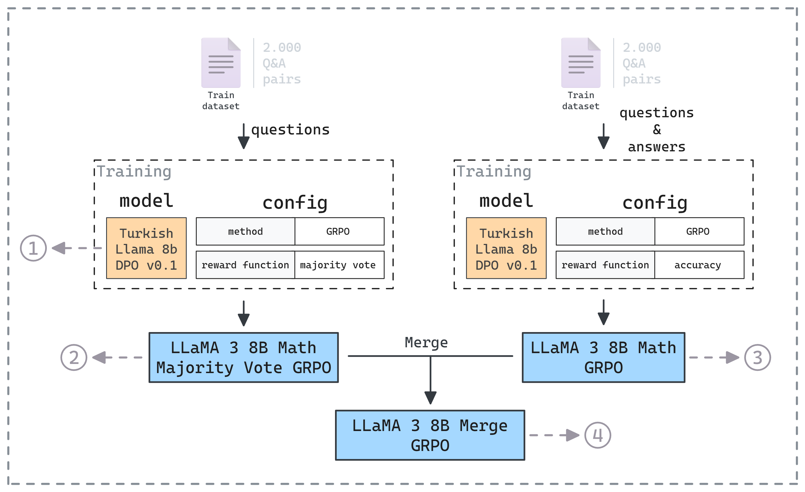

# Test Time Reinforcement Learning (TTRL)

A few weeks ago, I came across a paper titled, **Test Time Reinforcement Learning (TTRL)**[^1] by Zuo et al. They propose a new reward function which removes the need for a label, or in another words, an answer during training. This instantly grabbed my attention as most of the time it can be a real headache to collect or synthetically generate them.

[^1]: https://arxiv.org/pdf/2504.16084

Their methodology is quite simple:

1. During training they sample N generations from the model.
2. They extract the answers from these generations and count them.
3. The most common answer is considered the correct one.
4. The reward for these N generations is then calculated according to this answer.

Here is a figure from the paper explaining the process visually:


Since then I wanted to do my own experiments and see if it really works or how much it improves the capabilities of the models. To be able to asses this, I needed to see if doing the same training run **with and without labels** would make a difference. So in the past week, I created a dataset suitable for this task, trained two models, and did some analysis on their test results to satisfy my curiosity.

In this blog post I will be talking about the details of the each step of my experiments, some related work, and my closing thoughts.

First lets talk about the data gathering and preprocessing part.

## Creating the Dataset

In my [previous blog post](post.html?slug=grpo-training), I fiddled with GRPO training, A reinforcement learning method proposed[^2] by researchers from DeepSeek.
I tried training a model on **Turkish financial math** questions. Picking this domain allowed me to use existing reward functions written by the community which helped me to jump-start my experiments. However, I was hasty to try this shiny new training method, so I made some mistakes while gathering the data.

[^2]: https://arxiv.org/abs/2402.03300

First, due to the nature of this domain, the questions had to be solved using mostly floating point operations. This complicated the training process unnecessarily, considering that LLMs even fail to perform basic operations on integers.


So this time I decided to go easy and select an **existing English math word problem dataset** to work on. I chose [orca-math-word-problems-80k](https://huggingface.co/datasets/mlabonne/orca-math-word-problems-80k)[^3] dataset curated by Maxime Labonne. I then randomly sampled **4.000 questions** from the dataset and **translated** them to Turkish using GPT-4.1. Since I also needed the labels to be able to compare the effectiveness of TTRL, I also **extracted the numerical answers** from the solutions given in this dataset using GPT-4.1 again.

[^3]: https://huggingface.co/datasets/mlabonne/orca-math-word-problems-80k

After that I **removed samples that contained non-digit characters** so that only questions with simple integer answers remained. This step filtered almost 35 percent of the data and I was left with **2.598 samples**. I split the remaining questions into **train (2.000)** and **test (598)** sets.

## Writing the Reward Function

Now that I had a dataset, I moved on to writing the reward functions. Last time I did a GRPO training on mathematical questions, I forgot that Turkish and English use dot and comma differently to represent the thousands separator and the decimal point. So this time, I used the proper locale casting functions to ensure that only answers which comply with the correct Turkish number format would be considered correct.

For the majority vote reward function, I calculated the **mode of the answers** extracted from N generations and **accepted it as correct**. In the case where **there is no mode** I just **randomly accepted one of the answers** as correct.



I also wrote a logging mechanism to log generations during the training. In fact the generations in the above figure are actually from the training phase.

## Training

As we have already discussed, in order to see if the TTRL works or not, we need to run thet **same training** using the **majority vote** and the usual **accuracy reward** functions. If the performance of both models is **close enough** at the end of the training, we can say that test time reinforcement learning could be a **viable alternative** to the standard way of how we train the models.



I also thought about **merging these two models** after training to see if it would score better on the test set. As you can also see from the figure, after the training phase is complete, we will have **4 models** to compare.

As usual I used RunPod[^4] to do the training, and a single training run took around **13 hours** on a **single L40S** GPU for each model.
I merged two models using MergeKit[^5]. I used the **SLERP method** with the following default configuration:

[^4]: https://www.runpod.io/
[^5]: https://github.com/arcee-ai/mergekit

```
slices:
  - sources:
      - model: Metin/LLaMA-3-8B-Math-GRPO
        layer_range: [0, 32]
      - model: Metin/LLaMA-3-8B-Math-Majority-Vote-GRPO
        layer_range: [0, 32]
merge_method: slerp
base_model: Metin/LLaMA-3-8B-Math-GRPO
parameters:
  t:
    - filter: self_attn
      value: [0, 0.5, 0.3, 0.7, 1]
    - filter: mlp
      value: [1, 0.5, 0.7, 0.3, 0]
    - value: 0.5
dtype: bfloat16
```

We have what we need for the evaluations, so let's start comparing the performance of the models on the test set.

## Evaluations

During the training I instructed the models to use the below response format:

```xml
<mantık>
...
</mantık>
<cevap>
...
</cevap>
```

This format allows us to **easily extract the numerical answer** from the model's output. However, one of the models we are going to compare is the base model I trained on, **Turkish-Llama-8b-DPO-v0.1** released by the Cosmos research group from Yıldız Technical University. Since this model is not trained using this output format, it will have problems following it. So, naturally, the first metric I wanted to calculate was the ratio of valid generations.

<!--  -->
@[html](assets/plots/html_files/valid_generation_ratios_strict.html, image=assets/plots/static_images/valid_generation_ratios_strict.png)

As expected the original model had a hard time following the output format. We can also see that the **merged model outperformed its ancestors**.
However to **make the comparisons fairer**, we could also try using a more **flexible parsing** method. Instead of checking if the output matches the format exactly, we can just look between the `<cevap></cevap>` tags.

@[html](assets/plots/html_files/valid_generation_ratios_flexible.html, image=assets/plots/static_images/valid_generation_ratios_flexible.png)
<!--  -->

Using a more flexible parsing method increased the validity ratio of the original model. It didn't effect the other models that much since they were already following the output format strictly. So from now on, I will give both flexible and strict results while comparing these models.

Okay, now that we know the ratio of valid answers from the models, lets move on to comparing their accuracy.

<!--  -->
@[html](assets/plots/html_files/correct_generation_ratios_strict.html, image=assets/plots/static_images/correct_generation_ratios_strict.png)

Here we can see that both LLaMA-3-8B-Math-Majority-Vote-GRPO and LLaMA-3-8B-Math-GRPO outperformed the base model. This is promising, as it suggests the authors of the TTRL paper are right and using ground truth answers to check the correctness of the responses during generation may not be necessary.
We also see that the accuracy of the merged model is lower than both of its ancestors.

Let's look at the results when we use the flexible parsing method:

@[html](assets/plots/html_files/correct_generation_ratios_flexible.html, image=assets/plots/static_images/correct_generation_ratios_flexible.png)
<!--  -->

Again, we see a huge improvement (+15.56 percentage points) for the base model. However, it is still scoring significantly lower than the trained ones. This somewhat confirms that our trained models perform better due to the capabilities they learned during the training, not just because they are following the output format correctly. Still, more analysis is needed to fully confirm this.

Before doing that lets compare the training logs of LLaMA-3-8B-Math-Majority-Vote-GRPO and LLaMA-3-8B-Math-GRPO:

### Training logs

@[html](assets/plots/html_files/training_logs.html, image=assets/plots/static_images/training_logs.png)

It is not surprising that both models have almost **exactly the same training logs** since we used the **same data** in the **same order** during training. The only meaningful difference is in the **accuracy reward** (which is calculated **by majority vote** for one model and **by comparing the answer with the ground truth** for the other model). This is also expected since the reward function we used for the model trained using TTRL (LLaMA-3-8B-Math-Majority-Vote-GRPO) doesn't consider the ground truth answer while calculating the reward. It just checks if the answers match the most common answer. 

It is kind of interesting to see that this training method works because if the model outputt the same incorrect response for each question in the training dataset, it would receive perfect rewards and this would lead to poor outcomes. This reminds me the videos of dogs that return the leash to their owners when they drop it intentionally 😁. The model doesn't have to answer the questions correctly or explain its reasoning. I wonder, given enough time and data, would it realize this? 🤔

### Verifying the Results
Until now, the results have shown that both models trained with TTRL and the classic GRPO with accuracy reward performs better than the baseline. However, I can't shake the feeling that this is simply because the output format I used is hard to follow for the base model. The ideal analysis would be going through each answer of the base model and extracting the values by hand. However, since that will take a long time, we will try a different approach.

There are two more methods we can use to compare the results of the models:
1. Pass@k
2. Cons@k

For both methods we generate k answers for each question in the test set.
**Pass@k** considers a question correct **if any of the k answers is correct**.
**Cons@k** is similar to the TTRL method. It takes the **most common answer** from the generated responses and **compares it with the ground truth**.

I wanted to look at these two metrics because generating multiple answers will increase **the chance of the base model following the correct output format**. Therefore, I generated 8 answers for each question in the test using the three models (Excluding the merged one, as it performed worse). Then, I calculated the accuracy metric for k = 1, 2, 4 and 8.

@[html](assets/plots/html_files/k_sampling_metrics_strict.html, image=assets/plots/static_images/k_sampling_metrics_strict.png)

Even though we sampled 8 answers for each question, the results don't look great for the base model when we use **strict answer matching**. Lets use the **flexible answer matching** to make it fairer again.

@[html](assets/plots/html_files/k_sampling_metrics_flexible.html, image=assets/plots/static_images/k_sampling_metrics_flexible.png)

Here we see that pass@8 performance of the Turkish-LLama-8b-DPO-v0.1 barely exceeds the pass@1 performances of the models I trained. This makes me more confident that the models are learning actual useful strategies for solving math questions.

## Related Works

Researchers from Tsinghua University revealed in their work, Does Reinforcement Learning Really Incentivize Reasoning
Capacity in LLMs Beyond the Base Model?[^6], that "the reasoning paths generated by RL-trained models are already included in the base models' sampling distribution. RL training boosts the performance by biasing the model’s output distribution toward paths that are more likely to yield rewards, therefore sampling
correct responses more efficiently".

I think this also also confirms why TTRL works. The base model **was already capable of solving** these questions, we just **pruned the distribution paths** so that the correct paths would get sampled more efficiently. I believe this is also why the model does not deteriorate but improves.

[^6]: https://arxiv.org/pdf/2504.13837

Just two weeks after the TTRL paper, researchers from Tsinghua University published another great paper focusing on a similar topic. They took test time training one step further and completely removed the need of pre-existing training data in their work titled: Absolute Zero: Reinforced Self-play Reasoning with Zero Data [^7]. They **generate the tasks on-the-fly** using the same model they train during the training. They also calculate the reward for **both proposing a task and solving it**. I haven't finished reading the paper but it contains many novel approaches in this field and I think we will see more and more training runs like this.

[^7]: https://arxiv.org/pdf/2505.03335

## Final Thoughts

I think test time training methods like TTRL and Absolute Zero Reasoner we discussed in this blog post, hold a great value since they ease the data collection stage and allow the models to improve on their own (sounds scary when it is worded like this😁). Sometimes new training paradigms work better on larger models because they require advanced reasoning capabilities to be successful. I believe TTRL is one of these paradigms and using a much bigger model would yield even better results.

---

*Last updated: May 18, 2025*